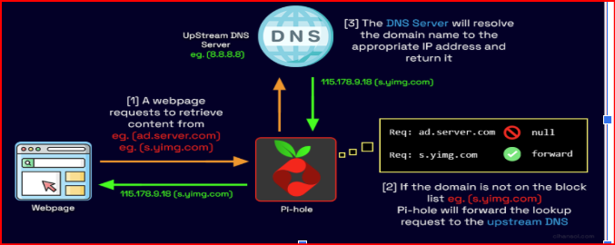
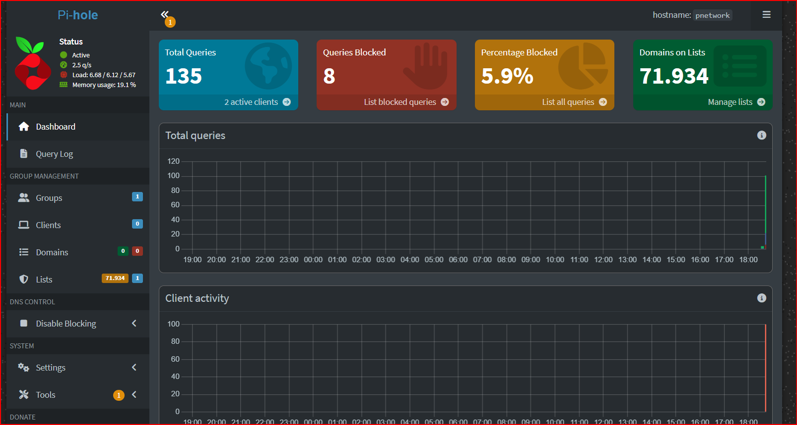

# Pi-hole on Raspberry Pi — IT Lab Project

## Executive Summary
This project documents the deployment of Pi-hole on a Raspberry Pi
as a local DNS filtering server in a real home network.

Beyond installation, the lab focuses on real-world troubleshooting,
including static IP configuration, DNS traffic analysis, and resolving
a production port conflict that caused service failure.

The project demonstrates hands-on Linux administration, networking,
and log-based problem solving in a constrained hardware environment.

---

## Introduction
Pi-hole is a DNS server that blocks ads, tracking, and potentially
malicious domains at the network level before they reach user devices.

This project was built as a hands-on IT lab to practice networking,
Linux services, and real troubleshooting, with a focus on IT and
cybersecurity fundamentals.

---

## Project Goal
Deploy Pi-hole on a Raspberry Pi as a local DNS filtering server,
documenting the setup process, issues encountered, troubleshooting
steps, and technical decisions made during the implementation.

---

## DNS Flow Overview

---
## Environment & Tools
- Raspberry Pi (Linux)
- Remote access via SSH
- Pi-hole
- lighttpd (web server)
- Main router with Internet access
- Secondary router: Huawei B311-221 (4G/LTE)
- Linux tools: `ssh`, `ping`, `journalctl`, `ss`, `systemctl`

## Implementation Steps

### Step 1 — Accessing the Raspberry Pi
A secure remote SSH connection was established to the Raspberry Pi
using its local IP address, confirming credentials and administrative
access.

ssh user@raspberry_ip

## Step 2 — Network Connectivity Check

Internet connectivity was verified by sending ICMP packets to a public
DNS server before continuing with the configuration.
ping -c 3 8.8.8.8

## Step 3 — Identify Local IP Address

The current IP address assigned to the Raspberry Pi was obtained for
proper identification within the local network.
hostname -I

## Step 4 — IP Assignment Method

Network configuration was reviewed using:
ip route
cat /etc/dhcpcd.conf

A static IP configuration was found for the wlan0 interface, although
the active IP was still assigned via DHCP.

## Step 5 — Applying Static IP

After updating the network configuration, SSH access was restored using
the new static IP.

Static IP applied: 192.168.1.50

SSH connection working

NetworkManager properly configured

SSH requested confirmation of a new host fingerprint due to the IP
change, which was validated successfully.

## Step 6 — Pi-hole Installation

Pi-hole was successfully installed on the Raspberry Pi.

Static IP configured

Upstream DNS provider selected

Pi-hole service running

Initial web credentials generated

Web admin interface enabled

## Step 7 — Issue Encountered: 403 Error and Port Conflict

When attempting to access the Pi-hole web dashboard, the browser
consistently returned a 403 error.

System logs were analyzed in real time using: journalctl -f

## Diagnosis

Logs showed that the lighttpd web server was attempting to bind to
port 80, which was already in use.

Error observed: bind() [::]:80: Address already in use
This caused:

lighttpd to fail

systemd to restart the service

an infinite restart loop

## Identifying the Port Conflict

To identify which process was using port 80, the following command was
executed: sudo ss -tulpn | grep :80

Result:

pihole-FTL was already listening on port 80

lighttpd attempted to use the same port

Port conflict
lighttpd restart loop

## Resolution

The solution was to move the web server to a different port.

Stop Pi-hole FTL:  sudo pihole-FTL stop

Edit lighttpd configuration: sudo nano /etc/lighttpd/lighttpd.conf 

Change:server.port = 80 To: server.port = 8080

## Restart services and verify: 

sudo systemctl restart lighttpd
sudo pihole-FTL start
sudo ss -tulpn | grep :80

## Result

Pi-hole running on port 80

lighttpd running on port 8080

Pi-hole dashboard accessible and working

##Router Connectivity Limitation

An attempt was made to connect two routers via Ethernet. However, the
Huawei B311-221 is a 4G/LTE router where the Ethernet port functions only
as LAN, not as a true WAN port.

## This means:

Internet access is provided only via mobile network

Wired WAN input is not supported

This limitation was:

Identified

Documented

Accepted

As a workaround, Pi-hole was deployed at host level, and DNS filtering
functionality was validated successfully

## Final Result

Pi-hole fully operational

Web dashboard accessible

Real DNS traffic visible

Multiple active clients

Consistent blocking percentage

The system works correctly within the constraints of the available
network hardware.

## Key Learnings

Practical DNS operation

Static IP configuration in Linux

Service management with systemd

Log-based troubleshooting using journalctl

Diagnosing and fixing port conflicts

Understanding real hardware and network limitations

Solving non-ideal, real-world IT problems

## Future Improvements

Deploy Pi-hole at full router level to enforce DNS filtering across
the entire network

Add basic security hardening (firewall rules, restricted admin access)

Enable monitoring and alerting for DNS failures and service downtime

Experiment with encrypted DNS (DoH / DoT) and compare performance
